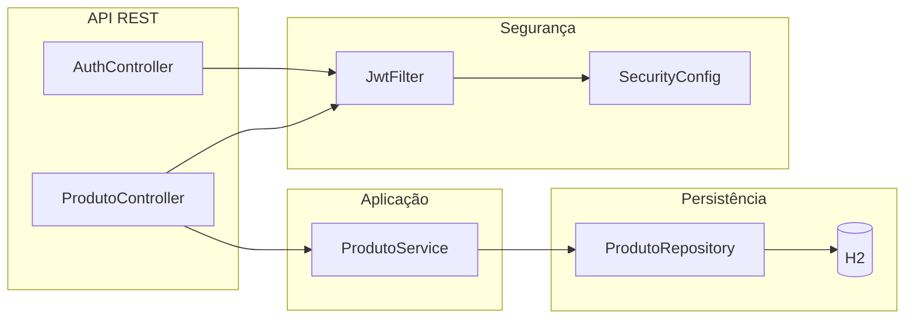
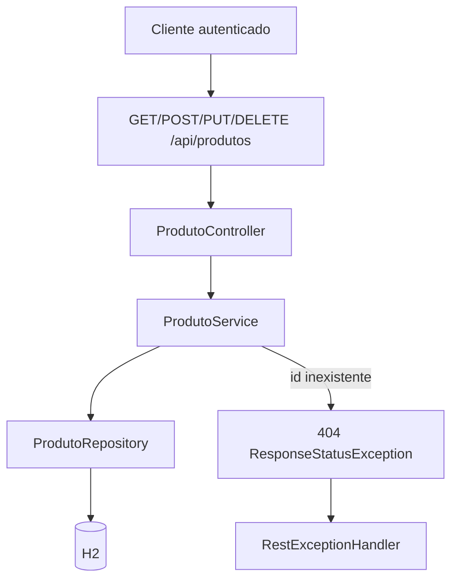
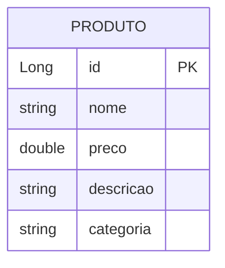
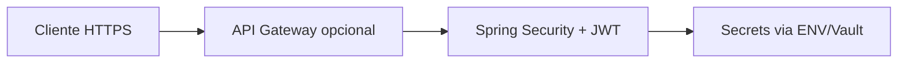

# 🚀 **Produtos API – REST com JWT e Spring Boot**

API REST para **cadastro e gestão de produtos** (CRUD), com **autenticação via JWT**, persistência em **H2 (em memória)**, **validação de entrada** e documentação interativa com **OpenAPI/Swagger**. Ideal como base de desafio técnico ou serviço enxuto de catálogo.

O sistema oferece:

* 🔐 Login com emissão de token JWT (Bearer)
* 📦 CRUD completo de produtos com validação Bean Validation
* 🗃️ Persistência JPA/Hibernate com H2
* 📘 Contrato HTTP documentado (Springdoc OpenAPI + Swagger UI)
* 🛡️ Spring Security stateless com filtro JWT
* ⚠️ Tratamento centralizado de erros (`ResponseStatusException`)
* 🐳 Imagem Docker para execução em container
* ✅ Testes unitários do serviço de produtos (Mockito)

---

## 📊 **Arquitetura do Sistema**

```mermaid
graph TB
    subgraph "Cliente"
        A[HTTP Client<br/>curl / Postman / Frontend]
    end

    subgraph "Spring Boot – produtos-api"
        B[SecurityFilterChain<br/>rotas públicas vs autenticadas]
        C[JwtFilter<br/>Authorization: Bearer]
        D[AuthController<br/>/auth/login]
        E[ProdutoController<br/>/api/produtos]
        F[ProdutoService]
        G[ProdutoRepository<br/>JpaRepository]
        H[RestExceptionHandler<br/>@ControllerAdvice]
        I[OpenApiConfig<br/>Bearer JWT no Swagger]
    end

    subgraph "Dados"
        J[(H2 in-memory<br/>produtosdb)]
    end

    A --> B
    B --> C
    C --> D
    C --> E
    D --> E
    E --> F
    F --> G
    G --> J
    E --> H
    I --> A
```

---

## 📦 **Estrutura do Projeto**

```
C:\Projetos\produtos-api\
│
├── src\
│   ├── main\
│   │   ├── java\com\desafioibgl\produtos_api\
│   │   │   ├── ProdutosApiApplication.java      # ✅ Entry point Spring Boot
│   │   │   ├── config\
│   │   │   │   ├── OpenApiConfig.java           # ✅ JWT Bearer no OpenAPI
│   │   │   │   └── RestExceptionHandler.java    # ✅ Erros HTTP padronizados
│   │   │   ├── controller\
│   │   │   │   ├── AuthController.java          # ✅ POST /auth/login
│   │   │   │   └── ProdutoController.java       # ✅ CRUD /api/produtos
│   │   │   ├── model\
│   │   │   │   └── Produto.java                 # ✅ Entidade JPA + validações
│   │   │   ├── repository\
│   │   │   │   └── ProdutoRepository.java       # ✅ JpaRepository
│   │   │   ├── security\
│   │   │   │   ├── JwtFilter.java               # ✅ Valida Bearer token
│   │   │   │   ├── JwtTokenUtil.java            # ✅ Geração / parse JWT
│   │   │   │   └── SecurityConfig.java          # ✅ Filtros e permissões
│   │   │   └── service\
│   │   │       └── ProdutoService.java          # ✅ Regras de negócio CRUD
│   │   └── resources\
│   │       └── application.properties           # ✅ H2, JPA, Swagger path
│   └── test\java\com\desafioibgl\produtos_api\
│       ├── ProdutosApiApplicationTests.java     # ✅ Contexto Spring
│       └── service\
│           └── ProdutoServiceTest.java          # ✅ Testes unitários (Mockito)
│
├── Dockerfile                                   # ✅ Java 17 + fat JAR
├── pom.xml                                      # ✅ Maven, Spring Boot 2.7.18
├── mvnw / mvnw.cmd                              # ✅ Maven Wrapper
├── .gitignore
└── .gitattributes
```

### 🧩 **Organização em camadas**

| Camada        | Pacote / classe        | Papel |
|---------------|------------------------|--------|
| API / Web     | `controller`           | HTTP, mapeamento de rotas |
| Segurança     | `security`, `config`   | JWT, filtros, OpenAPI security scheme |
| Domínio       | `model`                | Entidade e validações |
| Persistência  | `repository`           | Acesso a dados JPA |
| Aplicação     | `service`              | CRUD e exceções de negócio (404) |
| Infra         | `application.properties` | Datasource H2, Swagger |

---

## 🧩 **Divisão de Responsabilidades**



| Responsabilidade              | Componente principal |
|------------------------------|----------------------|
| Emissão e validação de JWT   | `JwtTokenUtil`, `JwtFilter` |
| Proteção de rotas            | `SecurityConfig` |
| Login (credenciais fixas demo) | `AuthController` |
| CRUD produtos                | `ProdutoController`, `ProdutoService` |
| Validação de payload         | `Produto` + Bean Validation |
| Erros 404 / corpo JSON       | `RestExceptionHandler`, `ResponseStatusException` |
| Documentação OpenAPI         | `OpenApiConfig`, Springdoc |

---

## 🗂️ **Funcionalidades Implementadas**

### ✅ **Status de Implementação**

| Funcionalidade | Status | Detalhes |
|----------------|--------|----------|
| **Login JWT** | ✅ | Credenciais demonstração; retorno `{ "token": "..." }` |
| **CRUD Produtos** | ✅ | Listar, obter por id, criar, atualizar, remover |
| **Validação** | ✅ | `nome`, `preco` (positivo), `descricao`, `categoria` obrigatórios |
| **Spring Security** | ✅ | Stateless; Bearer JWT nas rotas protegidas |
| **Swagger / OpenAPI** | ✅ | UI em `/swagger-ui.html`; esquema Bearer |
| **H2 + Console** | ✅ | Banco em memória; console liberado para desenvolvimento |
| **Docker** | ✅ | `openjdk:17-jdk-slim`, porta 8080 |
| **Testes** | ✅ | `ProdutoServiceTest` (buscar por id, 404) |

---

### 🔐 **1. Autenticação (JWT)** ✅

* `POST /auth/login` com corpo JSON `email` e `senha`
* Usuário de demonstração: `admin@exemplo.com` / `admin123` (apenas para ambiente de exemplo)
* Token JWT HS512, validade configurada na geração (~1 hora no código atual)
* Requisições à API de produtos: header `Authorization: Bearer <token>`

---

### 📦 **2. CRUD de Produtos** ✅

**Entidade `Produto`:**

| Campo      | Tipo   | Validação |
|-----------|--------|-----------|
| `id`      | Long   | Gerado (identity) |
| `nome`    | String | `@NotBlank` |
| `preco`   | Double | `@NotNull`, `@Positive` |
| `descricao` | String | `@NotBlank` |
| `categoria` | String | `@NotBlank` |

**Fluxo:**



---

### 📡 **3. Endpoints** ✅

#### **Auth**

```
POST   /auth/login              # ✅ Corpo: { "email", "senha" } → { "token" }
```

#### **Produtos** *(requer JWT)*

```
GET    /api/produtos            # ✅ Listar todos
GET    /api/produtos/{id}       # ✅ Buscar por id (404 se não existir)
POST   /api/produtos            # ✅ Criar (valida body)
PUT    /api/produtos/{id}       # ✅ Atualizar (404 se não existir)
DELETE /api/produtos/{id}       # ✅ Remover (404 se não existir)
```

#### **Documentação e utilitários** *(públicos na config atual)*

```
GET    /swagger-ui.html         # ✅ Swagger UI (springdoc)
GET    /v3/api-docs             # ✅ OpenAPI JSON/YAML
GET    /h2-console/**           # ✅ Console H2 (dev)
```

---

## 🗃️ **Modelo de dados (JPA)**



**Tabela:** gerenciada pelo Hibernate (`ddl-auto=update`) no H2.

---

## 🎯 **Como executar**

### **Maven (local)**

```bash
cd C:\Projetos\produtos-api
.\mvnw.cmd spring-boot:run
```

Aplicação padrão: **http://localhost:8080**

### **Build JAR e execução**

```bash
.\mvnw.cmd clean package -DskipTests
java -jar target\produtos-api-0.0.1-SNAPSHOT.jar
```

### **Docker**

```bash
.\mvnw.cmd clean package -DskipTests
docker build -t produtos-api .
docker run -p 8080:8080 produtos-api
```

---

## 🧪 **Testes**

```bash
.\mvnw.cmd test
```

* `ProdutoServiceTest`: busca por id com sucesso; lança exceção quando id não existe (`Mockito` + `JpaRepository` mockado).

---

# 🔐 **Segurança e boas práticas**

## **O que está implementado**

* Sessão **stateless** (sem cookie de sessão no servidor)
* Filtro **JWT** antes de `UsernamePasswordAuthenticationFilter`
* Rotas públicas explícitas: login, Swagger, OpenAPI, H2 console
* **Bean Validation** nos dados de produto

## **Recomendações para produção**

* **Não** usar credenciais fixas no código; integrar **UserDetailsService** + banco ou provedor de identidade
* **Externalizar** o segredo JWT (`JwtTokenUtil`) via variável de ambiente ou Secret Manager — nunca commitar segredo real
* Preferir **HTTPS** em produção
* Reavaliar exposição do **H2 console** e do **Swagger** (restringir por perfil `dev` ou IP)
* Considerar **refresh tokens**, revogação e política de expiração alinhada ao produto



---

## 📚 **Documentação adicional**

* **Swagger UI:** após subir a aplicação, abra **http://localhost:8080/swagger-ui.html**
* **HELP.md:** guia Spring Boot inicial do projeto (se presente)

---

**Desenvolvido para o desafio IBGL – Produtos API**
