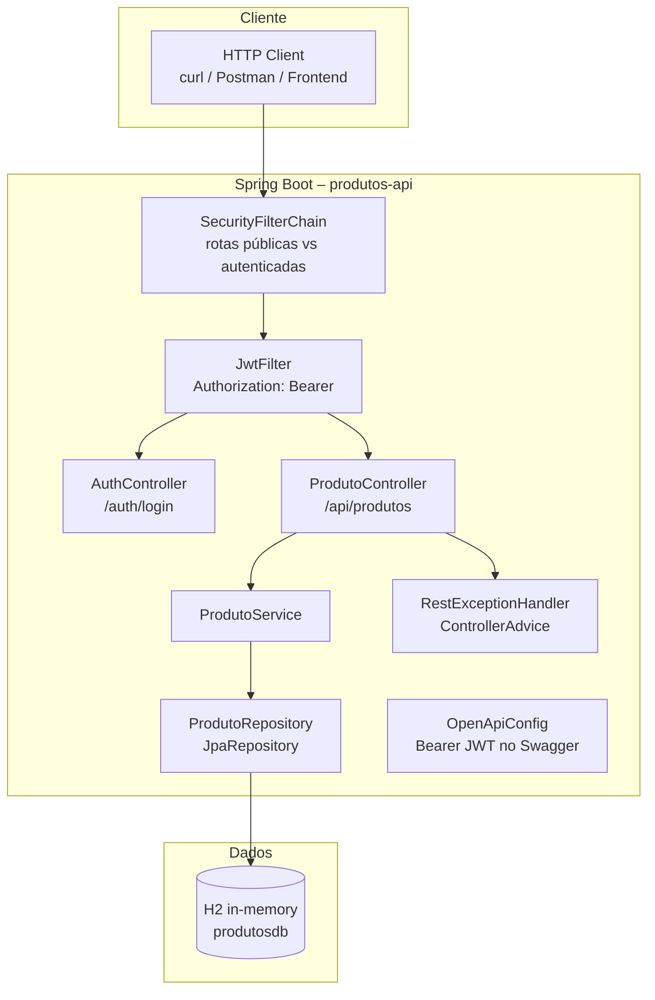
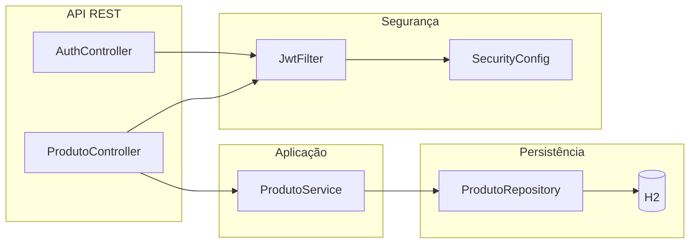
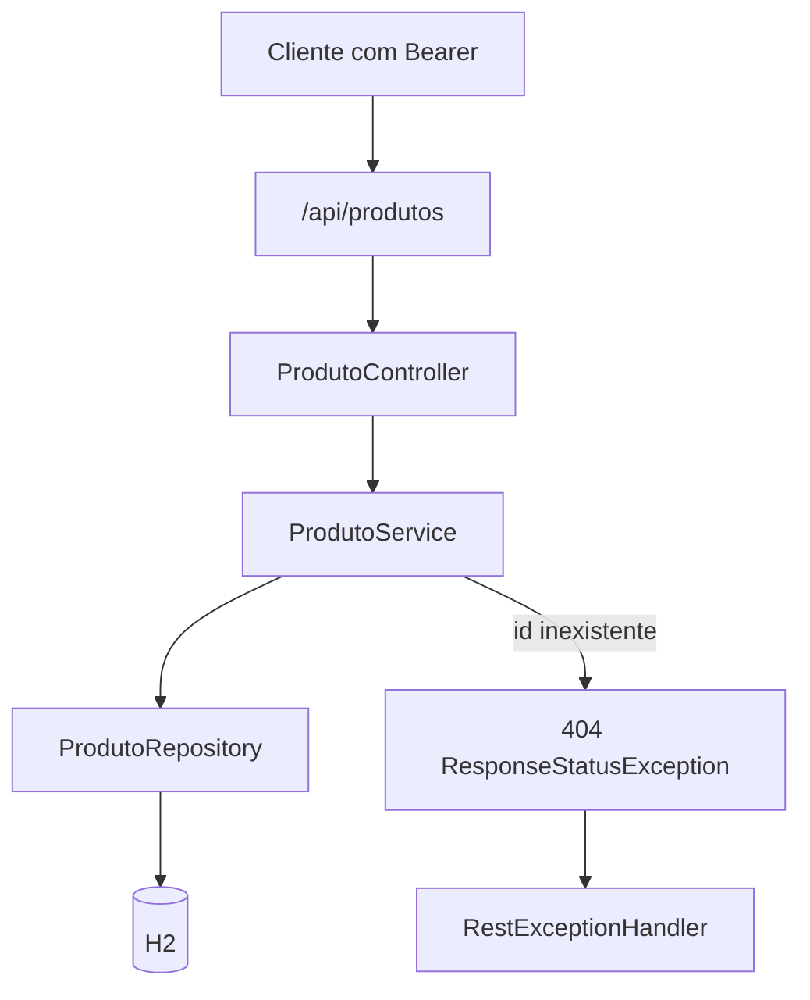
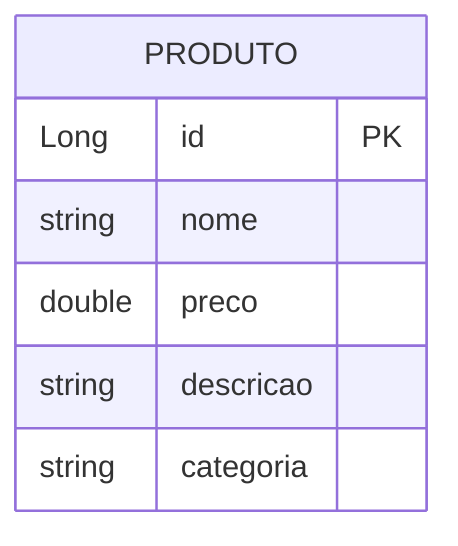

# Produtos API – REST com JWT e Spring Boot

API REST para cadastro e gestão de produtos (CRUD), com autenticação JWT, persistência H2 em memória, validação de entrada e documentação OpenAPI/Swagger.

**Recursos:** login com token Bearer; CRUD de produtos com Bean Validation; JPA/Hibernate; Spring Security stateless; Springdoc; tratamento centralizado de `ResponseStatusException`; Dockerfile; testes unitários do serviço com Mockito.

---

## Arquitetura do sistema



---

## Estrutura do projeto

```
C:\Projetos\produtos-api\
├── src\main\java\com\desafioibgl\produtos_api\
│   ├── ProdutosApiApplication.java
│   ├── config\          (OpenAPI, tratamento de exceções REST)
│   ├── controller\      (auth, produtos)
│   ├── model\
│   ├── repository\
│   ├── security\        (JWT + SecurityConfig)
│   └── service\
├── src\main\resources\application.properties
├── src\test\...
├── Dockerfile
└── pom.xml
```

| Camada | Pacote / recurso | Papel |
|--------|------------------|--------|
| API | `controller` | Rotas HTTP |
| Segurança | `security`, `config` | JWT, filtros, Bearer no Swagger |
| Domínio | `model` | Entidade e validações |
| Persistência | `repository` | JPA |
| Aplicação | `service` | CRUD e 404 |



---

## O que cada arquivo faz 

### `ProdutosApiApplication.java`

Ponto de entrada: `@SpringBootApplication` liga auto-configuração (Web, JPA, Security, etc.) e sobe o contexto ao rodar `main`.

```6:13:src/main/java/com/desafioibgl/produtos_api/ProdutosApiApplication.java
@SpringBootApplication
public class ProdutosApiApplication {

	public static void main(String[] args) {
		SpringApplication.run(ProdutosApiApplication.class, args);
	}

}
```

---

### `OpenApiConfig.java`

Registra o esquema **HTTP Bearer / JWT** no OpenAPI para o Swagger UI enviar o header `Authorization` nas operações protegidas.

```10:26:src/main/java/com/desafioibgl/produtos_api/config/OpenApiConfig.java
@Configuration
public class OpenApiConfig {
    @Bean
    public OpenAPI customOpenAPI() {
        return new OpenAPI()
                .addSecurityItem(new SecurityRequirement().addList("Bearer Authentication"))
                .components(new Components().addSecuritySchemes("Bearer Authentication", createSecurityScheme()));
    }

    private SecurityScheme createSecurityScheme() {
        return new SecurityScheme()
                .name("Bearer Authentication")
                .type(SecurityScheme.Type.HTTP)
                .scheme("bearer")
                .bearerFormat("JWT");
    }
}
```

---

### `RestExceptionHandler.java`

`@ControllerAdvice` intercepta `ResponseStatusException` (por exemplo 404 do `ProdutoService`) e devolve um corpo JSON com timestamp, status HTTP e mensagem de erro.

```11:23:src/main/java/com/desafioibgl/produtos_api/config/RestExceptionHandler.java
@ControllerAdvice
public class RestExceptionHandler {

    @ExceptionHandler(ResponseStatusException.class)
    public ResponseEntity<Object> handleResponseStatusException(ResponseStatusException ex) {
        Map<String, Object> body = new LinkedHashMap<>();
        body.put("timestamp", LocalDateTime.now());
        body.put("status", ex.getStatus().value());
        body.put("error", ex.getReason());
        
        return new ResponseEntity<>(body, ex.getStatus());
    }
}
```

---

### `AuthController.java`

`POST /auth/login` recebe `email` e `senha` no JSON. Em ambiente de demo, valida credenciais fixas e retorna `token` gerado por `JwtTokenUtil`; caso contrário responde 401.

```9:27:src/main/java/com/desafioibgl/produtos_api/controller/AuthController.java
@RestController
@RequestMapping("/auth")
public class AuthController {

    @Autowired
    private JwtTokenUtil jwtUtil;

    @PostMapping("/login")
    public ResponseEntity<?> login(@RequestBody Map<String, String> credenciais) {
        String email = credenciais.get("email");
        String senha = credenciais.get("senha");

        if ("admin@exemplo.com".equals(email) && "admin123".equals(senha)) {
            String token = jwtUtil.generateToken(email);
            return ResponseEntity.ok(Map.of("token", token));
        }
        return ResponseEntity.status(401).body("Credenciais invalidas");
    }
}
```

---

### `ProdutoController.java`

Mapeia `/api/produtos` para listar, buscar por id, criar, atualizar e remover, delegando ao `ProdutoService`. Exige autenticação (JWT) pela configuração global de segurança.

```10:42:src/main/java/com/desafioibgl/produtos_api/controller/ProdutoController.java
@RestController
@RequestMapping("/api/produtos")
public class ProdutoController {

    @Autowired
    private ProdutoService service;

    @GetMapping
    public List<Produto> listar() {
        return service.listarTodos();
    }

    @GetMapping("/{id}")
    public ResponseEntity<Produto> buscar(@PathVariable Long id) {
        return ResponseEntity.ok(service.buscarPorId(id));
    }

    @PostMapping
    public Produto criar(@RequestBody Produto produto) {
        return service.salvar(produto);
    }

    @PutMapping("/{id}")
    public ResponseEntity<Produto> atualizar(@PathVariable Long id, @RequestBody Produto produto) {
        return ResponseEntity.ok(service.atualizar(id, produto));
    }

    @DeleteMapping("/{id}")
    public ResponseEntity<Void> deletar(@PathVariable Long id) {
        service.deletar(id);
        return ResponseEntity.noContent().build();
    }
}
```

---

### `Produto.java`

Entidade JPA com `id` gerado; Lombok (`@Data`, construtores) reduz boilerplate. Bean Validation garante nome, descrição e categoria não vazios e preço não nulo e positivo.

```11:32:src/main/java/com/desafioibgl/produtos_api/model/Produto.java
@Entity
@Data
@NoArgsConstructor
@AllArgsConstructor
public class Produto {
    @Id
    @GeneratedValue(strategy = GenerationType.IDENTITY)
    private Long id;

    @NotBlank(message = "O nome e obrigatorio")
    private String nome;

    @NotNull(message = "O preco e obrigatorio")
    @Positive(message = "O preco deve ser maior que zero")
    private Double preco;

    @NotBlank(message = "A descricao e obrigatoria")
    private String descricao;

    @NotBlank(message = "A categoria e obrigatoria")
    private String categoria;
}
```

---

### `ProdutoRepository.java`

`JpaRepository<Produto, Long>` fornece `save`, `findById`, `findAll`, `delete`, etc., sem implementação manual.

```7:9:src/main/java/com/desafioibgl/produtos_api/repository/ProdutoRepository.java
@Repository
public interface ProdutoRepository extends JpaRepository<Produto, Long> {
}
```

---

### `ProdutoService.java`

Orquestra o repositório: `buscarPorId` usa `orElseThrow` com `NOT_FOUND` (404); `atualizar` carrega a entidade, copia campos e persiste; `deletar` remove após garantir que o id existe.

```17:42:src/main/java/com/desafioibgl/produtos_api/service/ProdutoService.java
    public List<Produto> listarTodos() {
        return repository.findAll();
    }

    public Produto buscarPorId(Long id) {
        return repository.findById(id)
                .orElseThrow(() -> new ResponseStatusException(HttpStatus.NOT_FOUND));
    }

    public Produto salvar(Produto produto) {
        return repository.save(produto);
    }

    public Produto atualizar(Long id, Produto produtoAtualizado) {
        Produto produto = buscarPorId(id);
        produto.setNome(produtoAtualizado.getNome());
        produto.setPreco(produtoAtualizado.getPreco());
        produto.setDescricao(produtoAtualizado.getDescricao());
        produto.setCategoria(produtoAtualizado.getCategoria());
        return repository.save(produto);
    }

    public void deletar(Long id) {
        Produto produto = buscarPorId(id);
        repository.delete(produto);
    }
```

---

### `JwtTokenUtil.java`

Gera JWT com *subject* = e-mail, emissão, expiração (1 hora no trecho abaixo) e assinatura **HS512** com segredo fixo; valida e extrai o usuário do token. Em produção o segredo deve vir de configuração segura.

```8:32:src/main/java/com/desafioibgl/produtos_api/security/JwtTokenUtil.java
@Component
public class JwtTokenUtil {
    private String secret = "ibgl_secret_key_2024";

    public String generateToken(String email) {
        return Jwts.builder()
                .setSubject(email)
                .setIssuedAt(new Date())
                .setExpiration(new Date(System.currentTimeMillis() + 3600000))
                .signWith(SignatureAlgorithm.HS512, secret)
                .compact();
    }

    public String getUsernameFromToken(String token) {
        return Jwts.parser().setSigningKey(secret).parseClaimsJws(token).getBody().getSubject();
    }

    public boolean validateToken(String token) {
        try {
            Jwts.parser().setSigningKey(secret).parseClaimsJws(token);
            return true;
        } catch (Exception e) {
            return false;
        }
    }
}
```

---

### `JwtFilter.java`

Para cada requisição: lê `Authorization: Bearer <token>`, valida com `JwtTokenUtil` e, se válido, monta `UsernamePasswordAuthenticationToken` no `SecurityContext` antes de seguir a cadeia de filtros.

```22:43:src/main/java/com/desafioibgl/produtos_api/security/JwtFilter.java
    @Override
    protected void doFilterInternal(HttpServletRequest request, HttpServletResponse response, FilterChain chain)
            throws ServletException, IOException {

        String authHeader = request.getHeader("Authorization");
        String token = null;
        String username = null;

        if (authHeader != null && authHeader.startsWith("Bearer ")) {
            token = authHeader.substring(7);
            if (jwtUtil.validateToken(token)) {
                username = jwtUtil.getUsernameFromToken(token);
            }
        }

        if (username != null && SecurityContextHolder.getContext().getAuthentication() == null) {
            UsernamePasswordAuthenticationToken auth = new UsernamePasswordAuthenticationToken(
                    username, null, new ArrayList<>());
            auth.setDetails(new WebAuthenticationDetailsSource().buildDetails(request));
            SecurityContextHolder.getContext().setAuthentication(auth);
        }
        chain.doFilter(request, response);
    }
```

---

### `SecurityConfig.java`

Desabilita CSRF; libera login, H2 console e Swagger; exige autenticação no restante; sessão **STATELESS**; desabilita `frameOptions` para o console H2 embutido; registra `JwtFilter` antes do filtro de usuário/senha padrão.

```19:30:src/main/java/com/desafioibgl/produtos_api/security/SecurityConfig.java
    @Bean
    public SecurityFilterChain filterChain(HttpSecurity http) throws Exception {
        http.csrf().disable()
            .authorizeRequests()
            .antMatchers("/auth/login", "/h2-console/**", "/swagger-ui/**", "/v3/api-docs/**", "/swagger-ui.html").permitAll()
            .anyRequest().authenticated()
            .and().sessionManagement().sessionCreationPolicy(SessionCreationPolicy.STATELESS);

        http.headers().frameOptions().disable();
        http.addFilterBefore(jwtFilter, UsernamePasswordAuthenticationFilter.class);
        
        return http.build();
    }
```

---

### `application.properties`

Define datasource H2 em memória (`produtosdb`), dialect JPA, console H2, `ddl-auto=update` e caminho do Swagger UI.

```1:9:src/main/resources/application.properties
spring.application.name=produtos-api
spring.datasource.url=jdbc:h2:mem:produtosdb
spring.datasource.driverClassName=org.h2.Driver
spring.datasource.username=sa
spring.datasource.password=
spring.jpa.database-platform=org.hibernate.dialect.H2Dialect
spring.h2.console.enabled=true
spring.jpa.hibernate.ddl-auto=update
springdoc.swagger-ui.path=/swagger-ui.html
```

---

### `Dockerfile`

Imagem JDK 17, copia o JAR construído pelo Maven como `app.jar`, expõe a porta 8080 e inicia a aplicação.

```1:5:Dockerfile
FROM openjdk:17-jdk-slim
ARG JAR_FILE=target/*.jar
COPY ${JAR_FILE} app.jar
EXPOSE 8080
ENTRYPOINT ["java","-jar","/app.jar"]
```

---

### Testes (`ProdutoServiceTest.java`)

Mock do `ProdutoRepository`: verifica que `buscarPorId` retorna o produto quando existe e que lança `ResponseStatusException` quando o id não é encontrado.

```24:42:src/test/java/com/desafioibgl/produtos_api/service/ProdutoServiceTest.java
    @Test
    void deveRetornarProdutoPorId() {
        Produto produto = new Produto(1L, "Notebook", 3000.0, "i5", "Informatica");
        when(repository.findById(1L)).thenReturn(Optional.of(produto));

        Produto resultado = service.buscarPorId(1L);

        assertNotNull(resultado);
        assertEquals("Notebook", resultado.getNome());
        verify(repository, times(1)).findById(1L);
    }

    @Test
    void deveLancarExcecaoQuandoNaoEncontrar() {
        when(repository.findById(99L)).thenReturn(Optional.empty());

        assertThrows(ResponseStatusException.class, () -> {
            service.buscarPorId(99L);
        });
    }
```

---

## Endpoints

| Método | Caminho | Auth | Descrição |
|--------|---------|------|-----------|
| POST | `/auth/login` | Não | Corpo: `email`, `senha` → `{ "token" }` |
| GET | `/api/produtos` | JWT | Lista produtos |
| GET | `/api/produtos/{id}` | JWT | Detalhe (404 se não existir) |
| POST | `/api/produtos` | JWT | Cria (valida corpo) |
| PUT | `/api/produtos/{id}` | JWT | Atualiza |
| DELETE | `/api/produtos/{id}` | JWT | Remove |
| GET | `/swagger-ui.html`, `/v3/api-docs/**` | Não | Documentação OpenAPI |
| GET | `/h2-console/**` | Não | Console H2 (dev) |

Fluxo resumido do CRUD autenticado:



---

## Modelo de dados (JPA)



---

## Como executar

**Maven (Windows):**

```bash
.\mvnw.cmd spring-boot:run
```

**JAR:**

```bash
.\mvnw.cmd clean package -DskipTests
java -jar target\produtos-api-0.0.1-SNAPSHOT.jar
```

**Docker:**

```bash
.\mvnw.cmd clean package -DskipTests
docker build -t produtos-api .
docker run -p 8080:8080 produtos-api
```

Base URL padrão: `http://localhost:8080`

**Testes:**

```bash
.\mvnw.cmd test
```

---

## Segurança e boas práticas

**Implementado:** sessão stateless; JWT via filtro; rotas públicas explícitas para login, documentação e H2; validação nos DTOs/entidade.

**Produção:** não usar credenciais fixas no `AuthController`; externalizar o segredo JWT; HTTPS; restringir ou desligar H2 console e Swagger fora de `dev`; considerar refresh tokens e armazenamento de usuários real.

---

## Documentação adicional

- Swagger UI: `http://localhost:8080/swagger-ui.html`
- `HELP.md`: guia Spring Boot do projeto (se disponível)

---

Desenvolvido para o desafio IBGL – Produtos API
